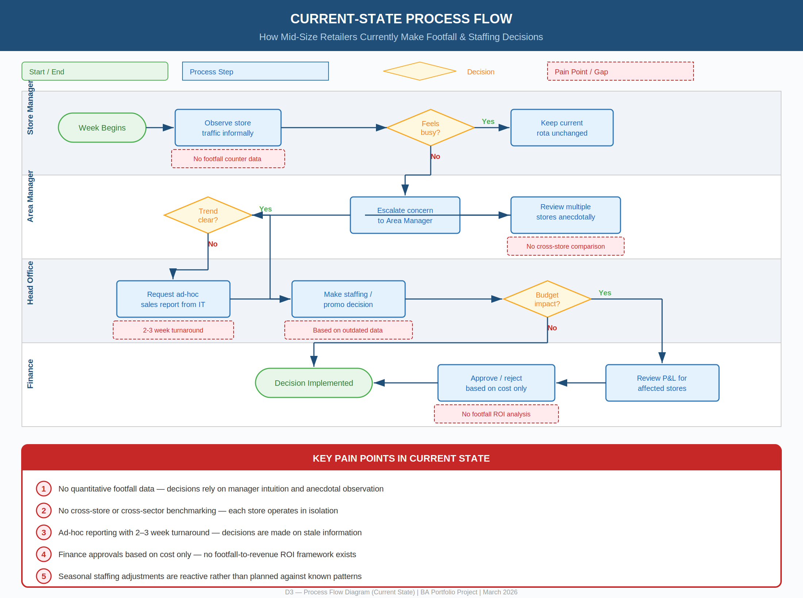
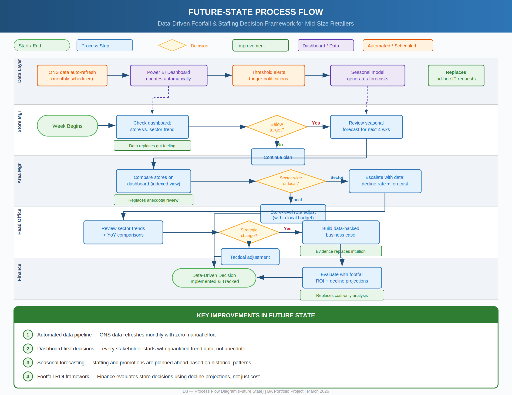

# UK Retail Footfall Analysis
### BA Portfolio Project — Data-Driven Footfall & Staffing Decision Framework for Mid-Size Retailers

[](https://github.com/manojkumarkavuri20-a11y/uk-retail-footfall-analysis) [](https://www.ons.gov.uk/) [](https://github.com/manojkumarkavuri20-a11y/uk-retail-footfall-analysis) [](https://github.com/manojkumarkavuri20-a11y/uk-retail-footfall-analysis)

## Project Overview

This project analyses the structural decline in UK high street retail footfall using publicly available ONS Retail Sales Index data (January 2017 – January 2026). It delivers a complete Business Analysis lifecycle — from problem definition to stakeholder-ready recommendations — demonstrating how mid-size non-food retailers can make data-driven decisions on staffing, store portfolio, and promotional investment.

**Problem:** Mid-size UK non-food retailers lack a clear, data-driven framework for understanding how footfall decline varies by sub-sector and time period, and what operational adjustments would most effectively protect in-store revenue.

**Solution:** A full BA project covering requirements, process mapping, interactive dashboard, and actionable recommendations grounded in 109 months of ONS data.

## Key Findings

| Sector | Jan 2019 Index | Jan 2026 Index | Change vs 2019 Avg |
|---|---|---|---|
| All Retail (exc. fuel) | 101.5 | 104.4 | +1.1% |
| Non-Food Stores | 104.9 | 105.6 | -2.2% |
| Textiles & Clothing | 103.0 | 100.0 | -4.4% |
| Household Goods | 111.0 | 104.0 | **-9.7%** |
| Non-Store (Online) | 81.0 | 113.7 | **+18.1%** |
| Department Stores | 111.5 | 100.5 | -5.5% |

- **Headline recovery masks structural shift** — total retail growth is almost entirely driven by online channels
- **Household goods** has the steepest sustained decline (-9.7% vs 2019 average)
- **Non-store retail growth has decelerated** — settling at ~18% above pre-pandemic levels
- **March is consistently the peak month** across non-food sub-sectors; January and August are the troughs

## D3 — Process Flow Diagrams

### Current State — How decisions are currently made (pain points highlighted)



### Future State — Data-driven decision framework



## Deliverables

| # | Deliverable | Format | Description |
|---|---|---|---|
| D1 | [Problem Statement & Business Case](D1_Problem_Statement_Business_Case.docx) | Word | Business problem definition, stakeholder analysis, objectives |
| D2 | [Requirements Document](D2_Requirements_Document.docx) | Word | MoSCoW-prioritised functional, non-functional & data requirements |
| D3 | [Process Flow Diagrams](D3_Current_State_Process_Flow.png) | PNG / SVG | Current-state & future-state swimlane process maps |
| D4 | [Interactive Dashboard](D4_UK_Retail_Dashboard.jsx) | React / JSX | ONS data dashboard with 6 chart views, KPI cards, sector toggles |
| D5 | [Findings & Recommendations](D5_Findings_Recommendations.docx) | Word | 5 data-grounded recommendations with effort/timeline/metric |
| D6 | [Stakeholder Presentation](D6_Stakeholder_Presentation.pptx) | PowerPoint | 11-slide leadership summary deck |

## Recommendations Summary

| # | Recommendation | Effort | Timeline | Primary Benefit |
|---|---|---|---|---|
| 1 | Align staffing rotas to seasonal ONS data | Low | 1–2 months | Labour cost reduction |
| 2 | Benchmark household goods performance to 2019 baseline (not 2021) | Medium | 1 month | Accurate target-setting |
| 3 | Prioritise store portfolio review for department store formats | High | 3–6 months | Cost avoidance / exit |
| 4 | Shift promotional spend from January to March | Medium | Next planning cycle | Revenue uplift |
| 5 | Implement monthly ONS dashboard monitoring | Low | Immediate | Evidence-based decisions |

## BA Lifecycle Covered

```
Problem Definition → Requirements (MoSCoW) → Process Mapping (As-Is / To-Be) → Data Analysis → Dashboard Build → Findings & Recommendations → Stakeholder Presentation
```

## Data Source

- **Dataset:** ONS Retail Sales Index (Dataset ID: DRSI)
- **Measure:** Chained volume of retail sales, seasonally adjusted, indexed to 2019 = 100
- **Coverage:** January 2017 – January 2026 (109 monthly observations)
- **Geography:** Great Britain (England, Scotland, Wales)
- **Source:** [ons.gov.uk](https://www.ons.gov.uk/) — downloaded March 2026
- **Status:** ONS Accredited Official Statistic

## Tech Stack

- **Data:** ONS open data (CSV)
- **Dashboard:** React + Recharts (interactive, browser-based)
- **Documentation:** Word (.docx), structured BA templates
- **Process Diagrams:** draw.io (PNG + SVG)
- **Version Control:** Git / GitHub

## Author

**Manoj Kumar Kavuri** — MSc International Business Management (Distinction)
Business Analysis | Data Analysis | UK Retail Domain Knowledge

[](https://www.linkedin.com/in/manojkumarkavuri/) [](https://github.com/manojkumarkavuri20-a11y)

> Open to Business Analyst, Operations Analyst, and Market Analyst roles across the UK.

## Changelog

### 24 March 2026
- Reviewed and validated ONS Retail Sales Index data for accuracy
- Updated project documentation to reflect final analysis scope
- Confirmed dashboard interactivity across all retail sub-sectors
